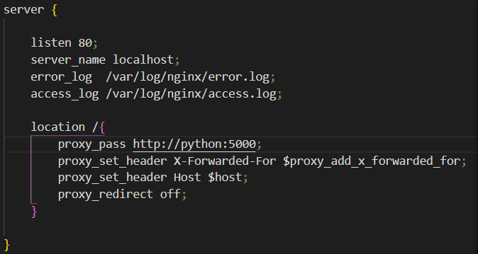
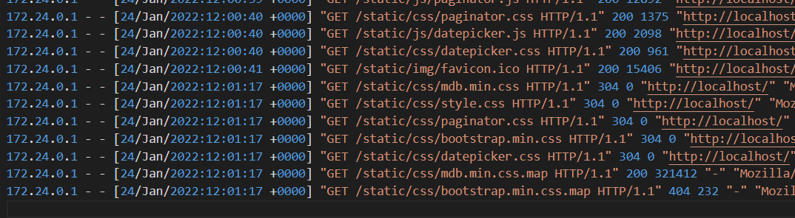
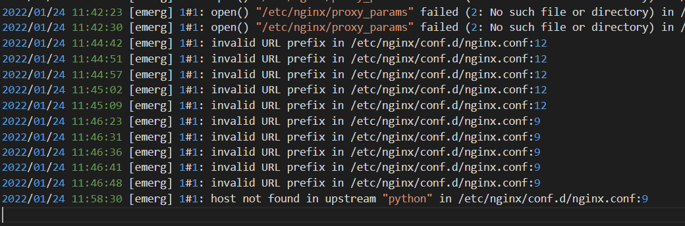
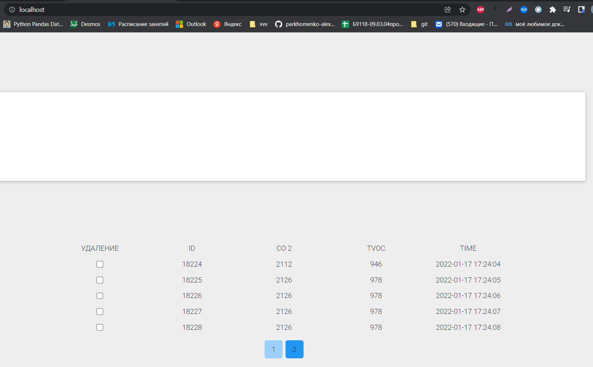
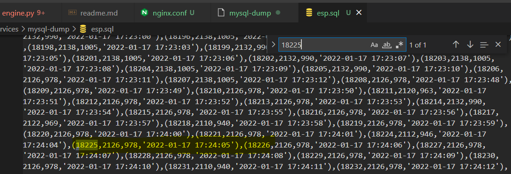

# Лабораторная 10
nginx conf

access log

error log
ошибки в ходе настройки

данные подгружаются из базы (проект взят с другого предмета), дамб которой смонтирован в докерок, дамп лежит в папке mysql-dump

